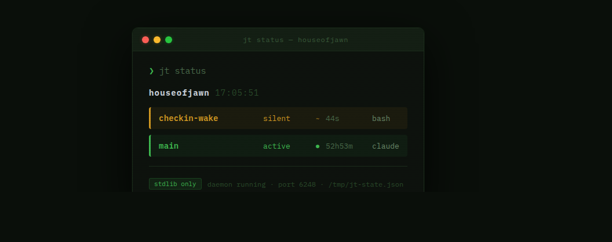

# jawn-tmux

[](https://github.com/jamditis/jawn-tmux/releases)
[](https://python.org)
[](LICENSE)
[](#install)
[](tests/)
[](#)

tmux session manager for AI agent workflows. Visual pane border attention, live sidebar, cross-node status.

**[Documentation & demo →](https://jamditis.github.io/jawn-tmux)**



---

## What it does

When you run multiple AI agents in parallel tmux sessions, it's hard to tell what's happening without switching between each one. jawn-tmux adds:

- **Colored pane borders** — green (active), amber (silent), gray (done), red (error)
- **Live sidebar** — 36-col right pane showing all sessions + output tails, refreshing every 2s
- **Interactive popup** — `Ctrl+B a` opens a status overlay; `k` kills, `q` closes
- **Cross-node status** — `jt nodes` aggregates sessions from all configured machines via HTTP

## How it works

Two processes:

**`jtd` (daemon)** polls tmux every 2 seconds, writes `/tmp/jt-state.json`, updates pane border colors, and serves the state JSON on port 6248 for cross-node polling.

**`jt` (CLI)** reads the state file directly for instant local status and hits remote nodes' HTTP endpoints for `jt nodes`.

```
jtd (systemd user service)
  ├── polls tmux list-sessions every 2s
  ├── writes /tmp/jt-state.json (atomic rename)
  ├── updates tmux pane borders via select-pane -P
  └── serves :6248/status (JSON, Tailscale-accessible)

jt (CLI)
  ├── reads /tmp/jt-state.json directly
  └── fetches <node-ip>:6248/status for remote nodes
```

## Install

Requires Python 3.11+, tmux 3.0+, systemd. Works on Linux ARM64, x86_64, and WSL2.

```bash
git clone https://github.com/jamditis/jawn-tmux.git ~/projects/jawn-tmux
cd ~/projects/jawn-tmux
chmod +x install.sh
./install.sh
```

The installer:
1. Installs `jt` and `jtd` to `~/.local/bin` via pip editable install
2. Appends `source-file .../tmux/jt.conf` to `~/.tmux.conf` (idempotent)
3. Copies the systemd unit to `~/.config/systemd/user/` and starts the service

Verify it's running:
```bash
systemctl --user status jtd
jt status
```

## Commands

| Command | Description |
|---------|-------------|
| `jt` / `jt status` | Table of all local sessions |
| `jt watch` | Live re-render loop (2s interval) |
| `jt popup` | Interactive status popup (`q` close, `k` kill) |
| `jt sidebar [on\|off\|toggle]` | Toggle 36-col persistent right pane |
| `jt spawn <name> <cmd>` | Create a named tmux session |
| `jt kill <name>` | Kill a session |
| `jt attach <name>` | Attach to a session |
| `jt nodes` | Aggregate status from all configured nodes |

## Tmux keybindings

Added via `source-file ~/projects/jawn-tmux/tmux/jt.conf`:

| Binding | Action |
|---------|--------|
| `Ctrl+B a` | Status popup |
| `Ctrl+B A` | Sidebar toggle |

## Session states

| Status | Trigger | Pane border |
|--------|---------|-------------|
| `active` | Output in last 20s | `#3fb950` green |
| `silent` | No output for 20s+ | `#d29922` amber |
| `done` | `CLAUDE_TASK_COMPLETE:0` in output | `#484f58` dim gray |
| `error` | Non-zero exit in marker | `#f85149` red |

The `done`/`error` states read the `CLAUDE_TASK_COMPLETE:$EXIT_CODE` marker written by [claude-scheduler](https://github.com/jamditis/houseofjawn-bot). The `main` session's border is never modified.

## Multi-node setup

Edit `~/.config/jt/nodes.json` with each node's Tailscale IP:

```json
[
  {"name": "houseofjawn", "ip": "100.122.208.15", "port": 6248},
  {"name": "officejawn",  "ip": "100.84.214.24",  "port": 6248}
]
```

`jt nodes` fetches each node's `/status` endpoint concurrently and renders a combined view. Unreachable nodes are shown as such without blocking.

## Development

```bash
git clone https://github.com/jamditis/jawn-tmux.git
cd jawn-tmux
pip3 install --break-system-packages -e .
python3 -m pytest -v
```

45 tests, stdlib only, no third-party runtime deps.

## File layout

```
jawn-tmux/
├── jt/
│   ├── cli.py        # argparse entry point
│   ├── daemon.py     # jtd — poller + HTTP server (port 6248)
│   ├── state.py      # read/write /tmp/jt-state.json
│   ├── render.py     # table, watch loop, popup layout
│   ├── tmux.py       # subprocess wrappers
│   └── nodes.py      # cross-node HTTP client
├── tests/            # 45 pytest tests
├── config/
│   └── nodes.json    # default node definitions
├── systemd/
│   └── jtd.service   # systemd user service unit
├── tmux/
│   └── jt.conf       # Ctrl+B a / Ctrl+B A keybindings
├── docs/             # GitHub Pages
└── install.sh        # installer
```

## Acknowledgments

jawn-tmux was inspired by [cmux](https://github.com/manaflow-ai/cmux) — a native macOS terminal built on Ghostty that pioneered the idea of visual session state for parallel AI agent workflows (blue ring indicators, per-workspace sidebars with branch/port/notification data). jawn-tmux adapts the same concept for Linux and tmux users who can't run macOS-native apps.

## Contributing

See [CONTRIBUTING.md](CONTRIBUTING.md). Issues and PRs welcome.

## License

MIT
