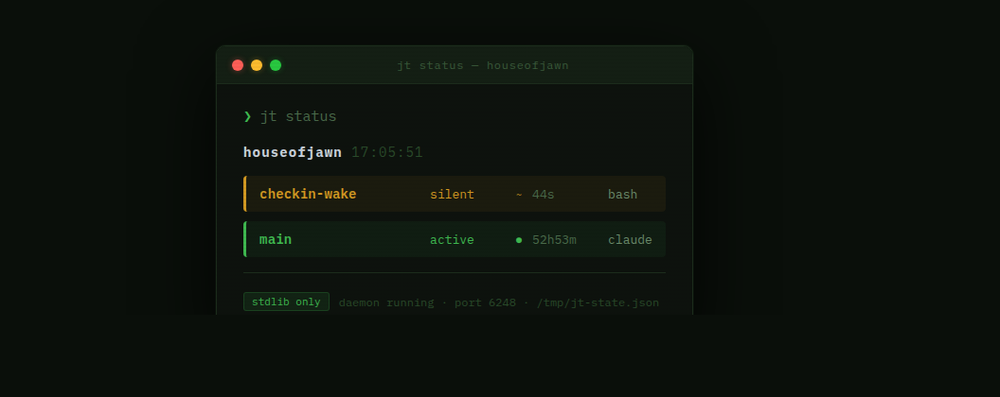

# jawn-tmux

[](https://github.com/jamditis/jawn-tmux/releases)
[](https://python.org)
[](LICENSE)
[](#install)
[](tests/)
[](#)

tmux session manager for AI agent workflows. Visual pane border attention, live sidebar, cross-node status.

**[Documentation & demo →](https://jamditis.github.io/jawn-tmux)**



---

## What is this?

If you run several AI agents at once — Claude Code, Codex CLI, an autonomous task runner, a long-running build — each one usually lives in its own [tmux](https://github.com/tmux/tmux/wiki) session (a persistent shell that survives logout). The problem: you can only look at one session at a time, so it's hard to tell which agents are working, which are idle, and which are done without flipping through them.

jawn-tmux watches every session in the background and turns each session's tmux pane border into a status light: **green** while the agent is producing output, **amber** when it has been quiet for more than 20 seconds, **gray** when finished, **red** on error. It also gives you a sidebar pane with a live table of every session, and a `jt nodes` command that shows the same view across multiple machines on a [Tailscale](https://tailscale.com) network.

**Who is this for?** Linux users who already use tmux and want a glanceable status for parallel agent runs. If you're new to tmux, the [tmux wiki](https://github.com/tmux/tmux/wiki) is a friendlier place to start.

## What it does

When you run multiple AI agents in parallel tmux sessions, it's hard to tell what's happening without switching between each one. jawn-tmux adds:

- **Colored pane borders** — green (active), amber (silent), gray (done), red (error)
- **Live sidebar** — 36-col right pane showing all sessions + output tails, refreshing every 2s
- **Interactive popup** — `Ctrl+B a` opens a status overlay; `k` kills, `q` closes
- **Cross-node status** — `jt nodes` aggregates sessions from all configured machines via HTTP

## How it works

Two background pieces:

- **`jtd`** — a small background process (a *daemon*) installed as a systemd user service. Every two seconds it asks tmux which sessions exist, classifies each one's state, repaints the pane borders, and writes a small JSON file describing what it found.
- **`jt`** — the command-line tool you use. It reads that JSON file directly, so `jt status` is instant. For `jt nodes` it also reaches out to each configured remote machine's `jtd` over HTTP.

```
jtd (systemd user service)
  ├── polls tmux list-sessions every 2s
  ├── writes $XDG_RUNTIME_DIR/jt-state.json (atomic, mode 0600)
  ├── updates tmux pane borders via select-pane -P
  └── serves :6248/status (bound to 127.0.0.1 by default)

jt (CLI)
  ├── reads the state file directly
  └── fetches <node-ip>:6248/status concurrently for remote nodes
```

The state file lives under `$XDG_RUNTIME_DIR` (typically `/run/user/$UID`) so it is private to the invoking user. If `XDG_RUNTIME_DIR` is not set the daemon falls back to `/tmp/jt-state.json`. Set `JT_STATE_FILE` to override.

## Install

Requires Python 3.11+, tmux 3.0+, systemd. Works on Linux ARM64, x86_64, and WSL2.

```bash
git clone https://github.com/jamditis/jawn-tmux.git ~/projects/jawn-tmux
cd ~/projects/jawn-tmux
chmod +x install.sh
./install.sh
```

The installer:
1. Installs `jt` and `jtd` to `~/.local/bin` via pip editable install
2. Appends `source-file .../tmux/jt.conf` to `~/.tmux.conf` (idempotent)
3. Copies the systemd unit to `~/.config/systemd/user/` and starts the service

Verify it's running:
```bash
systemctl --user status jtd
jt status
```

## Commands

| Command | Description |
|---------|-------------|
| `jt` / `jt status` | Table of all local sessions |
| `jt watch` | Live re-render loop (2s interval) |
| `jt popup` | Interactive status popup (`q` close, `k` kill) |
| `jt sidebar [on\|off\|toggle]` | Toggle 36-col persistent right pane |
| `jt spawn <name> <cmd>` | Create a named tmux session |
| `jt kill <name>` | Kill a session |
| `jt attach <name>` | Attach to a session |
| `jt nodes` | Aggregate status from all configured nodes |

## Tmux keybindings

Added via `source-file ~/projects/jawn-tmux/tmux/jt.conf`:

| Binding | Action |
|---------|--------|
| `Ctrl+B a` | Status popup |
| `Ctrl+B A` | Sidebar toggle |

## Session states

| Status | Trigger | Pane border |
|--------|---------|-------------|
| `active` | Output in last 20s | `#3fb950` green |
| `silent` | No output for 20s+ | `#d29922` amber |
| `done` | `CLAUDE_TASK_COMPLETE:0` in scheduler log | `#484f58` dim gray |
| `error` | Non-zero exit in marker | `#f85149` red |

The `done`/`error` states read the `CLAUDE_TASK_COMPLETE:$EXIT_CODE` marker from `/tmp/<prefix>_<unix_ts>.txt`, where `<unix_ts>` matches the tmux session's creation time within 60 seconds. The daemon scans two prefixes by default — `claude_scheduled` (used by [claude-scheduler](https://github.com/jamditis/houseofjawn-bot)) and `codex_scheduled` (used by Codex CLI scheduler wrappers). Set `JT_OUTPUT_FILE_PREFIXES=claude_scheduled,codex_scheduled,my_runner` to add your own. Sessions without a matching log file only move between `active` and `silent`. The `main` session's border is never modified.

## Multi-node setup

By default, `jtd` only binds the HTTP listener to `127.0.0.1`. The state JSON
contains agent stdout tails, so the listener stays local until you opt in.

To enable cross-node aggregation, point `JT_BIND` at the host's Tailscale IP
(or another private interface) via a systemd drop-in:

```bash
systemctl --user edit jtd
```

```ini
[Service]
Environment=JT_BIND=<your-tailscale-ip>
```

(replace `<your-tailscale-ip>` with the actual address you see in `tailscale status` for this machine — `100.64.0.11` is just a placeholder.)

Editing the unit doesn't restart it — apply the change explicitly:

```bash
systemctl --user daemon-reload
systemctl --user restart jtd
```

Then list your machines in `~/.config/jt/nodes.json`:

```json
[
  {"name": "houseofjawn", "ip": "100.64.0.11", "port": 6248},
  {"name": "officejawn",  "ip": "100.64.0.12",  "port": 6248}
]
```

`jt nodes` fetches each node's `/status` endpoint concurrently and renders a
combined view. Unreachable nodes are shown as such without blocking.

### Environment variables

| Variable | Default | Purpose |
|----------|---------|---------|
| `JT_BIND` | `127.0.0.1` | HTTP bind interface for `jtd`. Set to a Tailscale IP to enable `jt nodes`. |
| `JT_PORT` | `6248` | HTTP port. |
| `JT_STATE_FILE` | `$XDG_RUNTIME_DIR/jt-state.json`, then `/tmp/jt-state.json` | Override the state file path. |
| `JT_LOG_LEVEL` | `INFO` | Log level for the daemon (`DEBUG`, `INFO`, `WARNING`, `ERROR`). |

## Development

```bash
git clone https://github.com/jamditis/jawn-tmux.git
cd jawn-tmux
pip3 install --break-system-packages -e .
python3 -m pytest -v
```

56 tests, stdlib only, no third-party runtime deps.

## File layout

```
jawn-tmux/
├── jt/
│   ├── cli.py        # argparse entry point
│   ├── daemon.py     # jtd — poller + HTTP server (port 6248)
│   ├── state.py      # read/write /tmp/jt-state.json
│   ├── render.py     # table, watch loop, popup layout
│   ├── tmux.py       # subprocess wrappers
│   └── nodes.py      # cross-node HTTP client
├── tests/            # 56 pytest tests
├── config/
│   └── nodes.json    # default node definitions
├── systemd/
│   └── jtd.service   # systemd user service unit
├── tmux/
│   └── jt.conf       # Ctrl+B a / Ctrl+B A keybindings
├── docs/             # GitHub Pages
└── install.sh        # installer
```

## Acknowledgments

jawn-tmux was inspired by [cmux](https://github.com/manaflow-ai/cmux) — a native macOS terminal built on Ghostty that pioneered the idea of visual session state for parallel AI agent workflows (blue ring indicators, per-workspace sidebars with branch/port/notification data). jawn-tmux adapts the same concept for Linux and tmux users who can't run macOS-native apps.

## Contributing

See [CONTRIBUTING.md](CONTRIBUTING.md). Issues and PRs welcome.

## License

MIT
